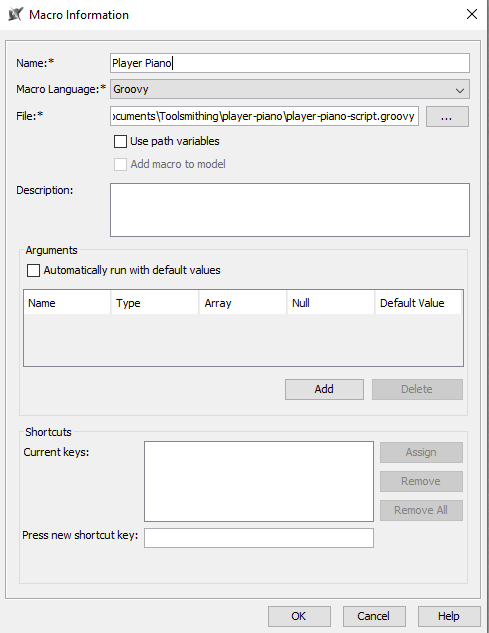
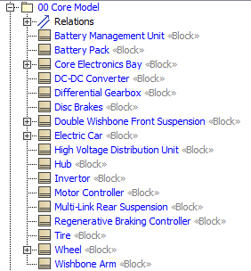

# Quick Start Guide and FALQ (Frequently Asked Leading Questions)

## Why Was This Tool Made?

Ingrid Nerdman capitalizes on the wealth of system model information described in a small number of common modeling patterns, from a modeling structure perspective. After identifying a common modeling patter, the systems engineering task becomes that of a data entry problem resulting in many systems engineering products capturing data in spreadsheets. Spreadsheets alone lack the structure to mark differences in the kids of information captured (components vs. functions), readily apparent to computers or even non-subject matter experts. Meanwhile, subject matter experts endow the data with semantic annotations without understanding how to express those annotations through the data structures. Thus, Ingrid seeks to address these issues by combining the data collection, semantic annotation and model creation into one workflow. Inspired by the approach taken by the Maple MBSE tool and the Excel Import in Cameo Systems Modeler, Ingrid Nerdman collects data from subject matter experts and non-subject matter experts in the form of an Excel spreadsheet and creates a wholly formed Cameo Model.

Commonly on MBSE projects, modeling professionals find themselves overwhelmed by the volume of information to capture, spending inordinate amounts of time transcribing those data. Ultimately, hurting the productivity of the team and preventing them from taking full advantage of their models; preparing queries and reports to support the larger engineering team. Automating the most straightforward and voluminous parts of the data wrangling effort, collecting and structuring the data according to common modeling patterns, allows the modeling experts to focus on best uses of those dat.

### If Inspired by Commercial Tools, Why Make a New One?

Primarily because it involves filling in gaps left behind by existing tools.

For one - Maple MBSE does not do comparisons between baseline models and updates on its own. It relies upon the facilities of the Teamwork Cloud or other modeling tools. Having Ingrid perform the change calculations makes it independent of the modeling tool used. It should be compatible with Cameo, Integrity Modeler, Rhapsody, Papyrus, or any other modeling tool. This also allows for engineers that do not have access to any of these tools to act as configuration managers to check that the collected and updated data are ready to go into the model.

For another - Cameo importers work well with string or value fields but do not handle importing the connections between modeling elements gracefully. Thus to making complete model updates requires additional effort. Here we can point out that the existence of the Excel and CSV imports lead the Ingrid team to de-emphasize bulk loading of these values and focus on the development of importing model elements and their links to each other.

## How Do I Get the Tool?

You have already succeeded in step one, which is to make it to this site. The tool is set up to be installed within a controlled conda environment after it is cloned from this Git repository.

See the README.md file for step-by-step install instructions for the Ingrid component.

The Player Piano component is a Groovy script intended to be run in Cameo System Modeler through the macro facility.

The player piano takes the basic commands created by the ricks-cafe code (e.g., create, replace, rename elements and attributes) and makes them compatible with the Cameo OpenAPI. A similar script could be written for any other modeling tool.

In Cameo, go to the Tools > Macros > Organize Macros menu as shown below. Then click the "Add" button to get to the Macro Information Dialog.

In the Macro Information dialog, set the macro name to "Player Piano." Set the Macro Language to Groovy and then locate the player-piano-script.groovy file and set it as the file for the macro. Press OK and the macro should now be loaded into your Cameo installation.

Once the macro is loaded, it there will now be a Tools > Macros > Player Piano menu item. Use this to launch the macro.

# Quick Start

## The Example Model

Included with the distribution is an Excel file that is configured to calculate inputs to the modeling templates. It uses multiple formulas to allow the entry of architectural entities and relationships in a modeling style that is compatible with but does not require knowledge of SysML. The model captures the basic composition of a system from its major working components and also connections and interfaces between them. Just for fun, it's an open source description of a Tesla 3-style electric sedan. The sheet will require exports to work with the Ingrid Nerdman workflow, but otherwise it is set up for immediate use.

### Major Tabs

The first tab in the example model sheet is a readme that guides you through the use of the sheets. Multiple sheets support the entry of useful information like the description of components, the way in which they are composed into their immediate assembly parent, full assembly paths for components, and connections between components. These sheets are then processed to fill information into the SysML-oriented templates that match specific, pre-defined modeling patterns.

## Processing Steps

### Creating the Input Files

The black-colored tabs are intended for direct export to the input file form. The easiest way to do this is to use Excel's built-in copy capability to create a new workbook with only the sheet in it. This will leave the links in cells active. To remove that dependency, you can bulk select (such as by holding Ctrl-Shift and using the arrow keys) the data table and copy-paste special (values) to make the cells simply have values in them.

The first sheet you do this for should have a name like "<PatternName> Starter.xlsx." The rest should be started as "<PatternName> Update.xlsx." Further steps will be taken to set baselines and add references to elements that are created in MagicDraw through the Player Piano scripting.
For this example, the "SystemParts" tab will be the starter file and the others will be updates.

### First Import Using "Create" Mode

Once the "SystemParts" tab has been exported to "System Parts Starter.xlsx," you can run the Rick's Cafe component in create mode through the following command (assuming the files are in a directory parallel to the ricks-cafe-american directory). The command will generate a new json file.

anaconda-project run cli --create --input "..\Ingrid Quick Start\System Parts Starter.xlsx"

In Cameo, open the "Import Example Base.mdzip" file. Then use the Tools > Macros > Player Piano menu item to launch the player piano script. Select a Package to be your default landing package ("Core Model"):

Then select your new `*.json` file to be the source of update instructions.

After the script runs, you should see a bunch of new modeling elements in the Package:

In addition to the model update, there will be a new `*.csv` file with the same name as your `*.json` file. It is a report that is generated by Player Piano to tell you what new elements were created as well as what the new ID's are in order to support further calculations.

### Adding Updates from Other Patterns Using "Compare" Mode

It is time to add more to the model. The next step would be to use the "System Spatial Parts Update.xlsx" as the update file. Open the file (it should just be the one SystemSpatialParts tab) and add a "Renames" tab. Make cell A1 "new name" and cell B1 "old name." Then make a "SystemSpatialParts IDs" tab. For that sheet, copy all the data and headers from the just-created `*.csv` file and paste it into this new IDs tab. Save this whole thing. Then re-save off to "System Spatial Parts Baseline.xlsx." Then run the command

anaconda-project run cli --compare --original "..\Ingrid Quick Start\System Spatial Parts Baseline.xlsx" --update "..\Ingrid Quick Start\System Spatial Parts Update.xlsx"

This will generate a new "graph_diff_changes 0-1(date-time).json" output file with new instructions. Rename this to System Spatial Parts Update.json.

Now run the Player Piano macro as before. You will have additional elements in your model. And also a new `*.csv` file recording the new elements.

You can continue to do the same with the "Interface Connection" tab and the "Interface Delegation" tab and you will have a new model!

### Rename Components and Updating Using "Compare" Mode

Blah

### Modifying Interface Type Using "Compare" Mode

Blah

### Possible Issues

If patterns are properly defined, there is a chance that the Player Piano will result in Cameo posting errors about model corruption or ill-formedness. This is likely due to a missing relationship or meta-attribute from the pattern. For example, if Properties do not have owners specified, this is considered an ill-formed model and it will trigger Cameo's model corruption detection.
