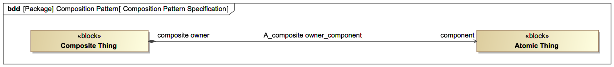
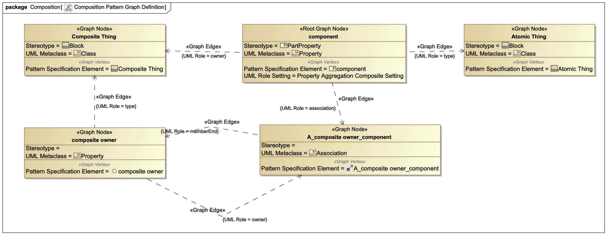

# Pattern Specification

System modeling patterns specify which kinds of modeling elements to use and in what combination to express  common engineering concepts in a repeatable and consistent form. These pattern specifications, and really any Unified Modeling Language (UML)-based model, is an instance of a number of UML metaclasses arranged together to convey specific ideas. The UML metamodel, in general, can readily be expressed as a graph since much of the definition of a UML metaclass described within the metamodel is characterized as a relationship (edge) to some other UML metaclass (node).

For example, The Composition Pattern shown below depicts a commonly recurring modeling pattern wherein an item, in this case, "Composite Thing" owns a part called "component" which is a type of "Atomic Thing".



This pattern has five instances of UML metaclasses: "Composite Thing", "Atomic Thing", "composite owner", "component", and "A\_composite owner\_component". "Composite Thing" and "Atomic Thing" are instances of a UML Class, "composite owner" and "component" are instances of a UML Property, and "A\_composite owner\_component" is an instance of a UML Association. Each of the elements in the pattern have a number of metaproperty relationships to other elements in the pattern. For example, "component" is owned by "CompositeThing."

As previously established, this pattern can be characterized as a graph shown below.



Each of the pattern elements, e.g. "Composite Thing", are depicted as nodes of the graph and the metaproperty relationships between them are expressed as edges. The pattern element, "component", is the root node of the graph from which it is possible to traverse a path to any other node in the graph. The spanning tree of the pattern graph makes it possible to map the path to a column heading within a spreadsheet and each cell can be interepreted as the name of the node. The spreadsheet template is shown below.

| Component                          | Position   | Composite Owner (Hidden)                                     | A\_Composite Owner\_component (Hidden)                 | Part                           |
| ---------------------------------- | ---------- | ------------------------------------------------------------ | ------------------------------------------------------ | ------------------------------ |
| /component/ owner/ Composite Thing | /component | /component/ association/ A\_composite owner\_component/ memberEnd/ composite | /component/ association/ A\_composite owner\_component | /component/ type/ Atomic Thing |

The headers show the column names which are to be used. These headers can be project-specific and are intended to be easily understood to stakeholders that are not invested in or familiar with the model. The values in the row show how entries in these columns can be found from a given node. The path here is a pattern of root node-edge-node-edge-node, where "nodes" are elements from the pattern specification (by the names given in the example above) and "edges" are UML metaproperties. The Hidden columns are those that can optionally not be shown in the spreadsheet and be computed using background information that is exported from the model.

In practice, each unique row in the spreadsheet is an instance of this pattern specification.

#### Aside on Optional Columns and Column Labeling
Every pattern contains a root node. The root node must appear as one of the columns in the Excel sheet. In a sense, the root node "anchors" the pattern for the Ingrid tool since the root node informs derived node names and acts as a quick reference to a particular subgraph(s). Despite appearing in the Excel, the root node does not necessarily have to represent a concept that translates to a "block" in the model. In fact, the Composition pattern exemplified here utilizes the `Position` (component) as the root node yet nodes in this column translate to the target side of the edge between the `Component` (Composite Thing) column and `Part` (Atomic Thing).

As alluded to above, Ingrid does not require the specification of the entire pattern graph explicitly in Excel columns. When Ingrid needs to create nodes to fill out the subgraph, Ingrid applies naming conventions utilizing the entry in the accompanying root node column. Examples will most succinctly describe the means Ingrid uses to derive node names:
- Node names with underscores
    - Suppose the pattern graph required a column titled `A_Composite Thing_composite owner`
        - Ingrid decomposes this column name into three parts by splitting on the underscore `_`: the prefix `A`, the first column to pull nodes from `Composite Thing`, and the second column to pull nodes from `composite owner`
        - Ingrid then concatenates this information together creating a new node for each row in the Excel file with the name `A_(Composite Thing node i)_(composite owner node i)`
        - If the column name contains a hyphenated suffix `-suffix` then that suffix appears at the end of the derived name `A_(Composite Thing node i)_(composite owner node i)-suffix`
- Node names with spaces
    - Suppose the pattern graph required a column titled `composite owner`
        - Ingrid splits the column name on the string so `composite owner` becomes `composite` and `owner`
        - Ingrid will check if the word before the space, `composite`, exists in the spreadsheet (either created by an earlier derived node or as part of the input data), using the column if found.
            - When Ingrid finds the column in the spreadsheet data, it creates a new node for each row in the excel following the convention `(node i from column found) qua (last item from string split on space) context`.
                - If `composite` represented a column in the Excel with a node named `composite_node`, Ingrid would create a new node `composite_node qua owner context`
        - When the word before the space does not map to a column, Ingrid creates new nodes using the first column in the Excel and the root column
            - A new node following this convention, for a first node named `first_node` and an accompanying first root named `first_root`, would have the name `first_node qua first_root context`
- Node names with anything else
    - Suppose the pattern graph required a column named `connection`
        - Ingrid grabs the data in the first column of Excel and creates new nodes starting with the node specified in each row and appending the name of the column Ingrid needs to complete the pattern.
            - Again, consider a node in the first column `first_node` and the column to be created `connection`. Ingrid creates new nodes, spanning the length of the input data, with names `(node i in the first column) (column to create)`. With the specific example node created `first_node connection`.

Since both the UML-based modeling pattern and the spreadsheet template share the same underlying graph representation it is possible to canonicalize the graph to a JSON used by the [`ingrid`](../../ingrid/README.md) tool. The basic form of the JSON is as follows:

```json
{
    "Columns to Navigation Map": {
        "Spreadsheet Column 1 name": [
          "Root Node name",
          "UML metaproperty",
          "intermediate Graph Node name",
          "UML metaproperty", //repeat node-edge pattern until you reach the target Graph Node
          "target Graph Node name"
        ],
        "Spreadsheet Column N name": [
          "Root Node name",
          "node-edge pattern"
          "target Graph Node name"
        ],
    },
    "Pattern Graph Edges": [
        [
            "Graph Edge 1 source name",
            "Graph Edge 1 target name",
          	"UML metaproperty"
        ],
        [
            "Graph Edge N source name",
            "Graph Edge N target name",
          	"UML metaproperty"
        ]
    ],
    "Root Node": "Root Node name",
    "Vertex MetaTypes": {
        "Graph Node 1 name": "pattern element UML metaclass name, e.g. Class",
        "Graph Node N name": "pattern element UML metaclass name, e.g. Association"
    },
    "Vertex Settings": {
        "Graph Node 1 name": {
          	"pattern element UML metaproperty setting 1, e.g. "aggregation : composite"",
            "pattern element UML metaproperty setting N"
        },
        "Graph Node N name": null //use null type if no settings applied
        },
    }
  	"Vertex Stereotypes": {
        "Graph Node 1 name": "pattern element applied stereotype name, e.g. Block",
        "Graph Node N name": null //use null type if no applied stereotypes
  			//currently only supports one applied stereotype
    }
}
```

The JSON for the Composition pattern is shown below:

```json
{
    "Columns to Navigation Map": {
        "Component": [
            "component",
            "owner",
            "Composite Thing"
        ],
        "Part": [
            "component",
            "type",
            "Atomic Thing"
        ],
        "Position": [
            "component"
        ]
    },
    "Pattern Graph Edges": [
        [
            "composite owner",
            "Composite Thing",
            "type"
        ],
        [
            "component",
            "Atomic Thing",
            "type"
        ],
        [
            "A_composite owner_component",
            "composite owner",
            "memberEnd"
        ],
        [
            "A_composite owner_component",
            "component",
            "memberEnd"
        ],
        [
            "component",
            "Composite Thing",
            "owner"
        ],
        [
            "composite owner",
            "A_composite owner_component",
            "owner"
        ]
    ],
    "Root Node": "component",
    "Vertex MetaTypes": {
        "A_composite owner_component": "Association",
        "Atomic Thing": "Class",
        "Composite Thing": "Class",
        "component": "Property",
        "composite owner": "Property"
    },
    "Vertex Settings": {
        "A_composite owner_component": null,
        "Atomic Thing": null,
        "Composite Thing": null,
        "component": {
            "aggregation": "composite"
        },
        "composite owner": null
    },
    "Vertex Stereotypes": {
        "A_composite owner_component": null,
        "Atomic Thing": "Block",
        "Composite Thing": "Block",
        "component": "PartProperty",
        "composite owner": null
    }
}
```

## Pattern Builder

GTRI is currently gathering a set of patterns in a Cameo Systems Modeler project as guidance for modeling. The opportunity is here to capture the patterns both to show good modeling practice but also to allow for rapid import and export from the model via easy-to-use forms like spreadsheets. Each UML modeling pattern has an accompanying graph representation leveraging a custom UML profile to convey the syntax and semantics needed to canonicalize the graph to a JSON. Additional customizations and a macro are built into the tool to generate an `ingrid` conformant JSON pattern stored in this directory.

The Pattern Builder will be published in future releases of Rapid Modeling Tools.
