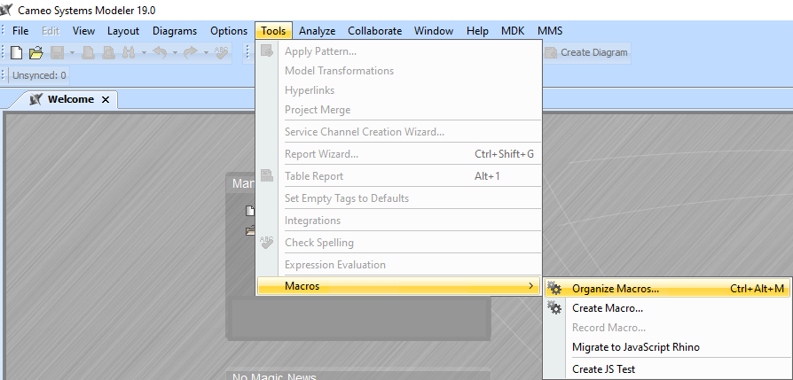

# Player Piano

The script `player-piano-script.groovy` supports the playback of MagicDraw instructions to the Open API to update models according the instructions generated by the `ingrid` tool.

## Unsupported Metatypes and Attributes
If you come across an unsupported metatype or attribute, please add the necessary definition to the switch cases in the `player-piano-script.groovy`.

```groovy
switch(new_meta) {

    case 'Class':
        new_element = ele_factory.createClassInstance();
        temp_ids[item_to_edit] = new_element.getID();
        temp_elements[item_to_edit] = new_element;
        new_element.setName(new_name);
        homeless_elements.add(new_element);
        break;
    .
    .
    .
    case "New Metatype":
        new_element = ele_factory.create__Metatype__Instance(); // This is a MagicDraw API call
        temp_ids[item_to_edit] = new_element.getID();
        temp_elements[item_to_edit] = new_element;
        new_element.setName(new_name);
        homeless_elements.add(new_element);
        ...
```

## Importing Player Piano as a MagicDraw Macro
The player piano takes the basic commands created by the ingrid code (e.g., create, replace, rename elements and attributes) and makes them compatible with the Cameo OpenAPI. A similar script could be written for any other modeling tool.

- With MagicDraw open locate the **Tools** menu
- Select `Tools > Macros > Organize Macros`
- For the `Name`, `Macro Language`, and `File` fields input "Player Piano", select "Groovy", and browse the file explorer (opened by clicking on the three dots button) to the `.../Rapid Modeling Tools/player-piano/player-piano-script.groovy` groovy script.
- Images included below




Once the macro is loaded, there will be a `Tools > Macros > Player Piano` menu item. Use this to launch the macro.

The script is written in Groovy, and can be activated in MagicDraw through the Macro Engine. See [MagicDraw Online Documentation](https://docs.nomagic.com/display/MD190/Adding+a+Macro+and+editing+Macro+information) for instructions on how to do this.

## Known Issues

### Player Piano Macro Does Not Launch in Cameo 2021xR2

The Player Piano macro in Cameo Systems Modeler 2021xR2 produces an error:

```
MagicDraw cannot execute the Groovy macro, please make sure that the C:\Users\test_user\rapid-modeling-tools-master\player-piano\player-piano-script.groovy is correct. startup failed: C:\Users\test_user\rapid-modeling-tools-master\player-piano\player-piano-script.groovy: 142: unable to resolve class JsonSlurper @ line 142, column 18. jsonSlurper = new JsonSlurper(); ^ 1 error org.codehaus.groovy.control.MultipleCompilationErrorsException: startup failed: C:\Users\test_user\rapid-modeling-tools-master\player-piano\player-piano-script.groovy: 142: unable to resolve class JsonSlurper @ line 142, column 18. jsonSlurper = new JsonSlurper(); ^ 1 error
```

The root issue is that Cameo 2021xR2 ships with the core
Groovy 3.0.7 JAR module that since
[version 2](http://groovy-lang.org/releasenotes/groovy-2.0.html#Groovy20releasenotes-AmoremodularGroovy)
does not include JSON utilities. (Both Cameo versions 2021xR1 and 190sp4 ship with the Groovy 2.4.15 `all` JAR that contains everything.)

Therefore, we need to update the plugin that executes Groovy scripts to explicitly import the JSON module.

1. Go to the root of your Cameo 2021xR2 installation.
  You should see a `plugins` folder.
2. Download the
   [groovy-json-3.0.7.jar](https://repo1.maven.org/maven2/org/codehaus/groovy/groovy-json/3.0.7/groovy-json-3.0.7.jar)
   to
   ```
   plugins\com.nomagic.magicdraw.automaton\lib\engines\groovy-3.0.7\lib
   ```
3. Open the plugin configuration in a text editor:
   ```
   plugins\com.nomagic.magicdraw.automaton\plugin.xml
   ```
   You should see a `<library>` XML element importing
   the core Groovy 3.0.7 JAR:
   ```
   <library name="lib/engines/groovy-3.0.7/lib/groovy-3.0.7.jar"/>
   ```
4. Add this line to `plugin.xml`
   just below the core Groovy import:
   ```
   <library name="lib/engines/groovy-3.0.7/lib/groovy-json-3.0.7.jar"/>
   ```
   This points the plugin to the module you downloaded.
5. Run Cameo 2021xR2 and execute the player piano macro.
   You should see a "Select Package" window appear without errors.